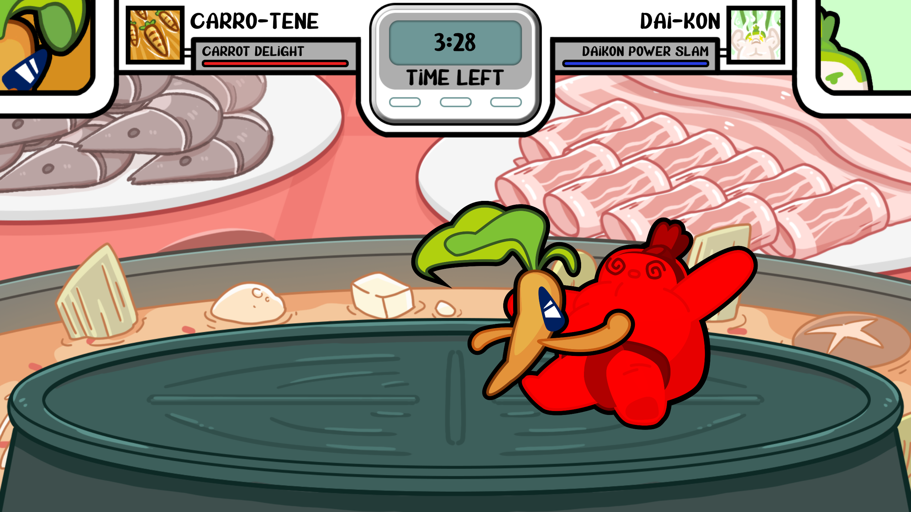
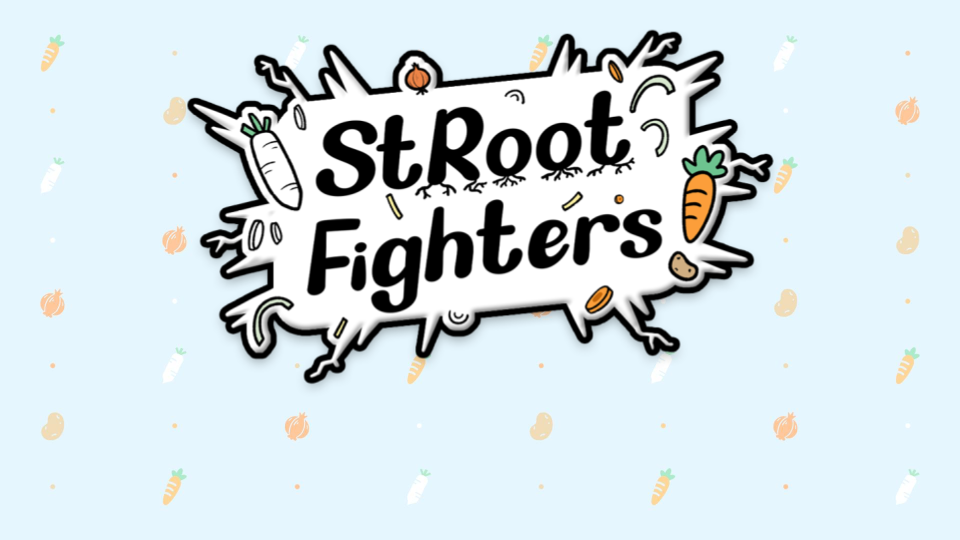
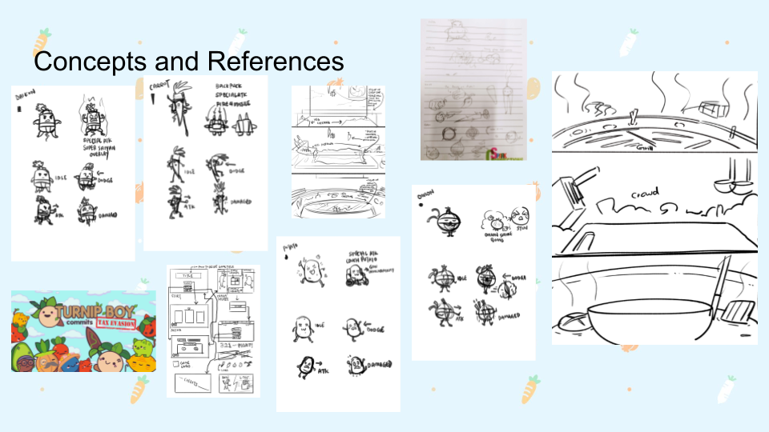
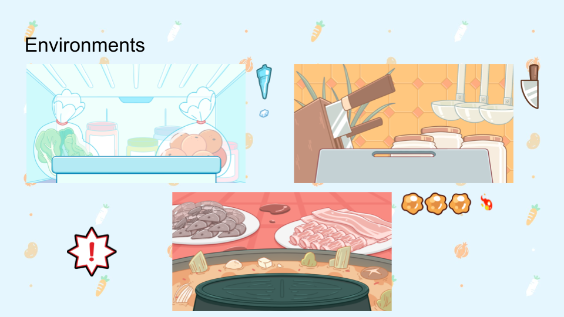
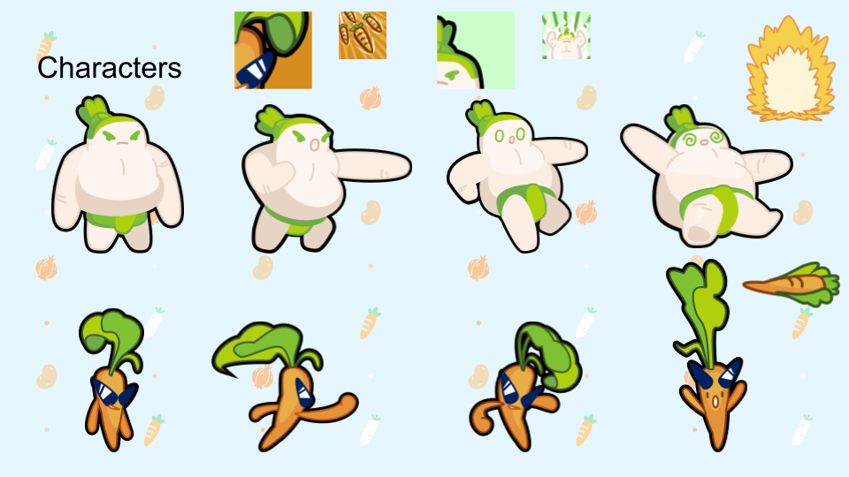
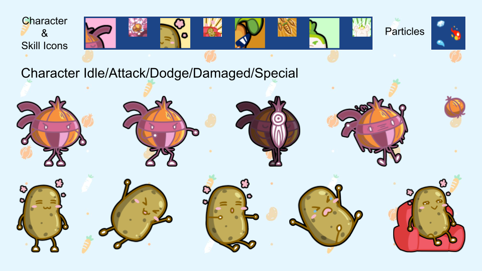
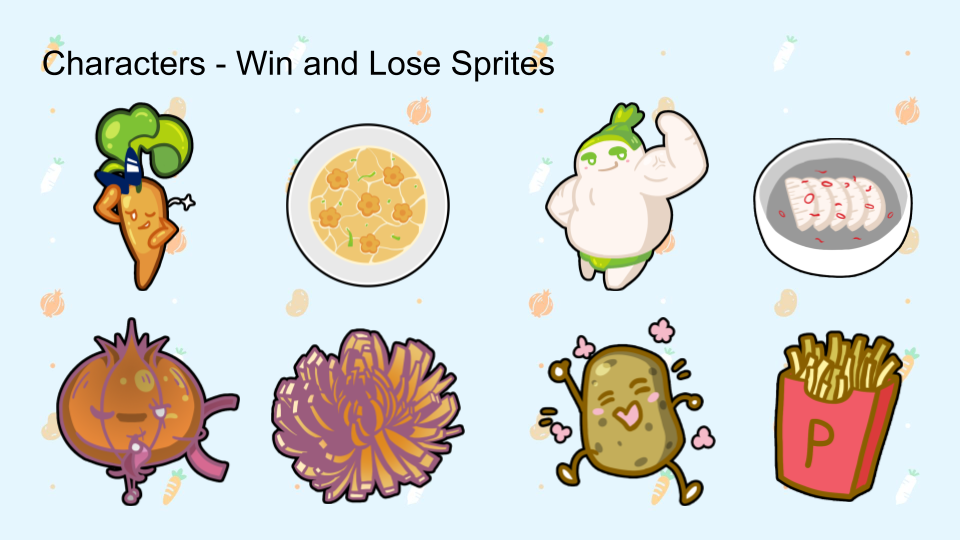
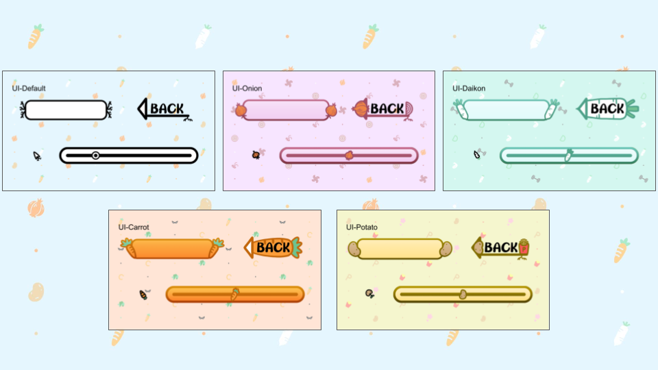
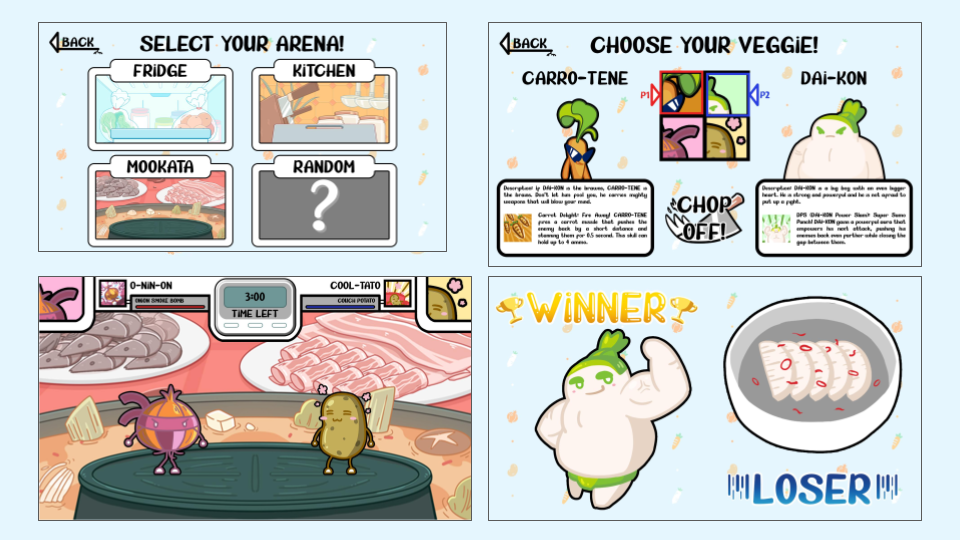

# Singapore Global Game Jam 2023
A simple collaboration repo for Singapore Global Game Jam 2023.

This project uses Unity 2021.3.16f1.

## About the Game

StRoot Fighters is a 2-player fighting game where players fight as vegetables against each other, with the goal of pushing the other off the arena.

Each character also comes with a special skill that can be used to create openings or advantages for the player. (To be implemented)

### How to play:
Only 3 buttons!
- Move forward/attack
- Move backward/dodge
- Special attack (To be implemented)

Player 1 (L): A/S/D
Player 2 (R): Left/Down/Right Arrow

Win by making the other player fall off the arena, or push your opponent as close to their edge of the arena as possible when the timer is up!

## Background

“A fruit can be a vegetable, but a vegetable is a culinary category…”

Every year, Veggie Queendom holds its annual tourney, with every city sending out their best warriors to battle it out in the area. Brave soldiers from the daikon city, potato city, carrot city and onion city tough it out in the kingdom’s glorious battlegrounds, with the winner being crowned the champion of Veggie Queendom. Who will be the prevailing winner of the tourneys, would an underdog rise up from the steam and snatch up the champaign? Battle it out in… StRoot Fighters - Coming to a hotpot near you.

## Game Concept

- Simple button gameplay with a tug-of-war push
- Versus game to play with friends

Game Logo 
 

Concept and References 
 

Environment Assets 
 

Character Sprites & Skill Icons 
 
 
 
UI Skins 
 
In-Game Screenshots 

